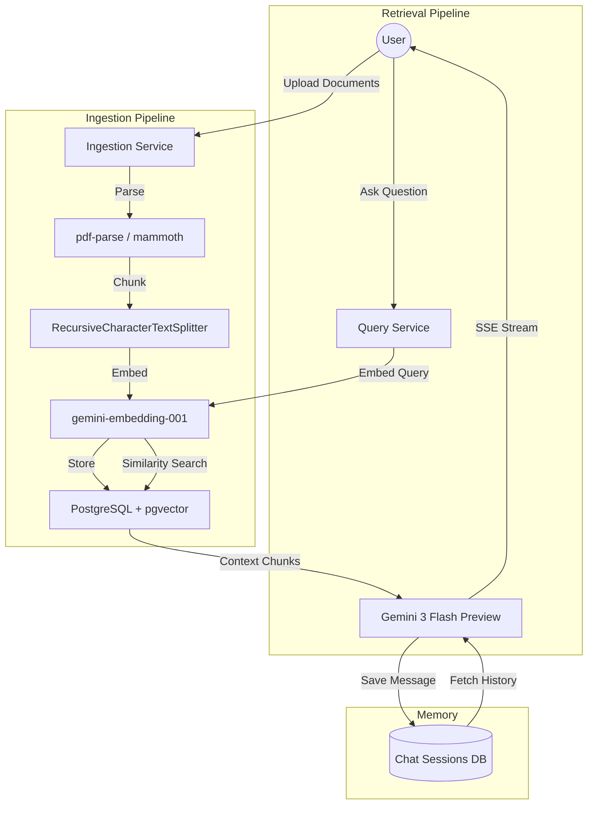

# AI Implementation & Architecture Notes

## 🏛️ System Architecture
The application follows a modular RAG (Retrieval-Augmented Generation) architecture designed for security, persistence, and real-time interaction.

## 🛠️ Technical Specifications

### 1. Ingestion Strategy
- **File Parsing**: 
    - `pdf-parse`: Handles PDF extraction. Dynamically imported to prevent build-time native binary conflicts.
    - `mammoth`: Standard-compliant DOCX to text conversion.
- **Chunking Logic**: 
    - **Chunk Size**: 500 characters.
    - **Overlap**: 100 characters.
    - **Strategy**: Semantic boundary detection using `RecursiveCharacterTextSplitter` to maintain technical context.

### 2. Vector Storage (PostgreSQL + pgvector)
- **Model**: `gemini-embedding-001` (768 dimensions).
- **Extension**: Using `pgvector` for native HNSW/IVFFlat indexing support.
- **Persistence**: Unlike Chroma or Pinecone in local mode, this setup ensures vectors persist across container restarts.

### 3. Generation & Memory
- **Model**: `gemini-3-flash-preview` chosen for its massive context window and rapid token generation.
- **SSE (Server-Sent Events)**: Responses are streamed using typed JSON chunks:
    - `TEXT`: Incremental answer fragments.
    - `SOURCES`: Metadata about retrieved document chunks for transparency.
- **Session Focus**: Multi-turn memory is managed via a `chat_sessions` table, preventing context drift in long conversations.

### 4. Hallucination Guardrails
- **Grounding**: The system prompt explicitly restricts the LLM to provided context.
- **Fallback**: Gemini is instructed to respond with "I don't have enough information in the provided documents" if no relevant chunks are found.

## 🔬 Optimization Notes
- **Webpack Externals**: Configured to handle native Node.js libraries in the Next.js server environment.
- **Standalone Docker**: Optimized for minimal image size (alpine-based) with isolated database persistence.
